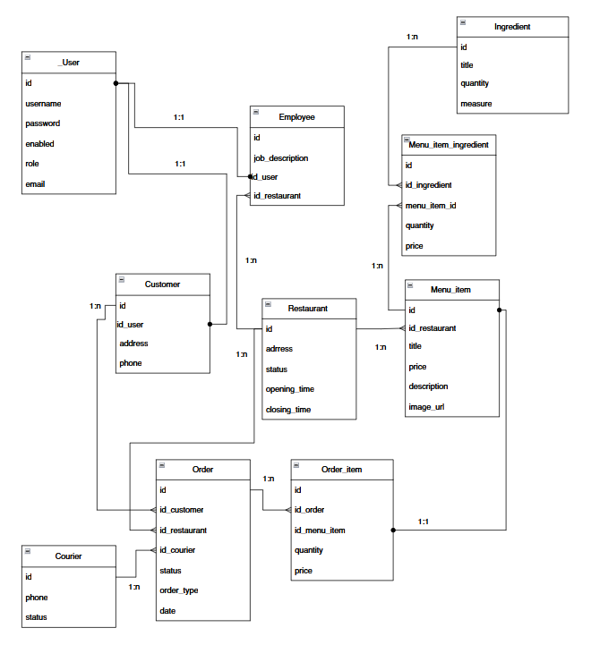
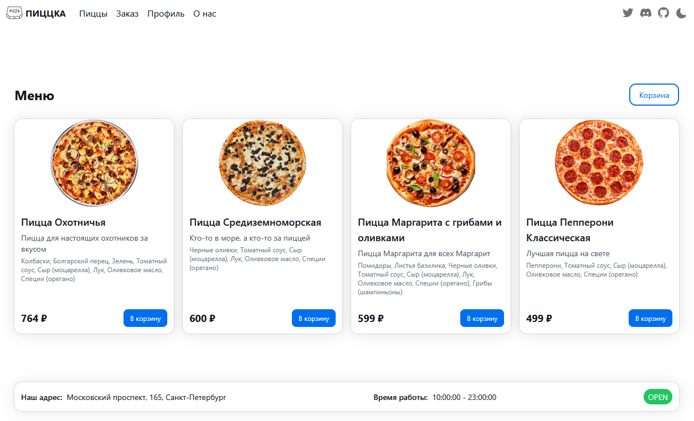
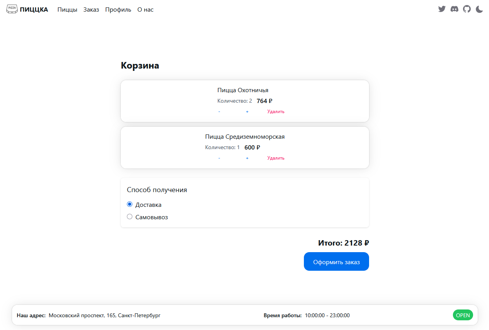
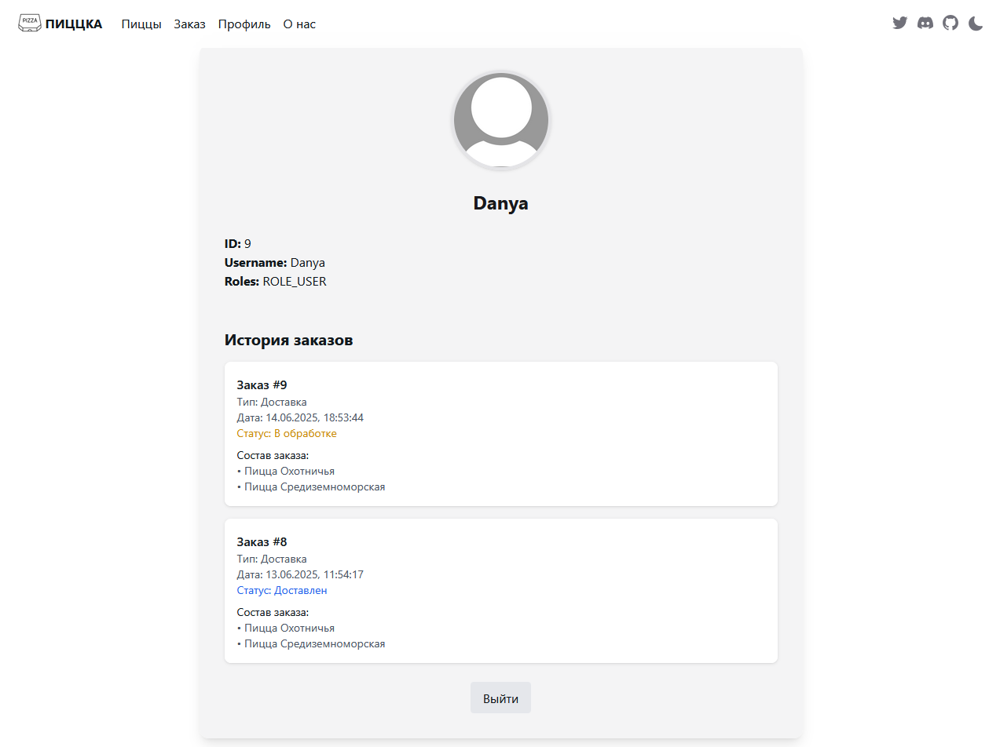

# Pizza Site

## Описание проекта

**Pizza Site** — это полнофункциональное приложение для управления сетью пиццерий, включающее веб-интерфейс для клиентов, сотрудников, курьеров и менеджеров, а также микросервисную backend-архитектуру.

---
## Технологии

### Frontend
- React, Vite, TypeScript
- HeroUI, TailwindCSS, Framer Motion
- React Router, Axios

### Backend
- Java 17, Spring Boot 3
- Spring Security, Spring Data JDBC, Spring Cloud Gateway
- JWT, OAuth2 Authorization Server
- PostgreSQL, MinIO 
---

## Архитектура проекта

- **Frontend**: React + Vite + HeroUI + TailwindCSS (директория `pizza-site`)
- **Backend**: Микросервисы на Spring Boot:
  - `api-gateway-service` — точка входа для всех клиентских запросов (пока не реализован)
  - `auth-service` — аутентификация пользователей, выдача JWT токенов
  - `pizza-resource-service` — бизнес-логика (работа с пиццами, заказами, сотрудниками и т.д.)
- **База данных**: PostgreSQL (docker-compose)
- **Хранилище файлов**: MinIO (docker-compose)

---

## Основной функционал

- Регистрация и вход пользователей (JWT, OAuth2)
- Роли: клиент, сотрудник, курьер, менеджер
- Просмотр и заказ пицц
- Управление заказами (создание, отслеживание, изменение статуса)
- Панели для сотрудников, курьеров, менеджеров
- Управление сотрудниками и ресторанами (для менеджеров)
- Хранение и загрузка файлов (например, фото пицц)

---

## Схема архитектуры

_Тут будет схема архитектуры проекта_

---

## Схема базы данных

---

## Внешний вид сайта

---
